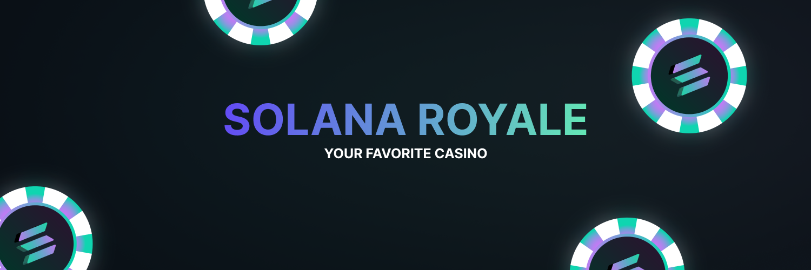

Welcome to the official GitHub page of **Solana Royale**, a premier crypto casino built on the Solana blockchain. Our platform offered thrilling games like Coinflip and Dice, providing an exciting and secure environment for cryptocurrency enthusiasts to test their luck.

## 🎉 Achievements

- [x] **Games Variety**: Provided popular games like Coinflip and Dice, catering to a wide range of player preferences.
- [x] **Transaction Range**: Allowed players to wager from 0.05 Solana to 5 Solana (£6 - £600), ensuring accessibility for both casual players and high rollers.
- [x] **User Engagement**: Attracted a vibrant community of players who enjoyed the seamless gaming experience.
- [x] **Fair Play**: Ensured fair and transparent gameplay using blockchain technology.

## Technology

- **Blockchain**: Leveraged the Solana blockchain for its speed and low transaction fees, providing a smooth and efficient gaming experience.
- **Advanced Security**:  Implemented state-of-the-art security measures to protect user funds and data.
- **Provable Fairness**: Used hash technology to ensure that all games were fair and transparent.

## 📉 Closure

> [!INFORMATION]
> Solana Royale was shut down in late 2022 due to the decline of the crypto market.

Unfortunately, **Solana Royale** was shut down in late 2022 due to the decline of the crypto market.